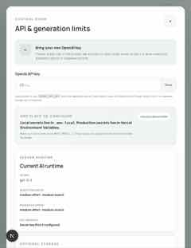
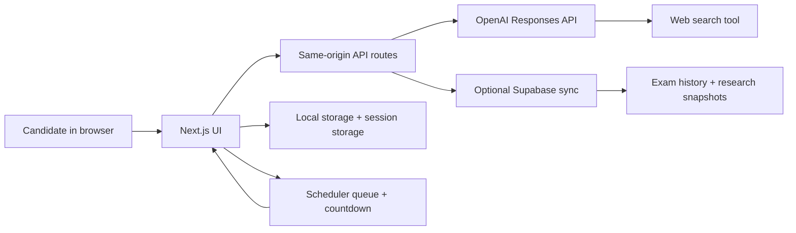

# PulseTest-AI

PulseTest-AI is a Next.js NEET PG / INI-CET practice platform that generates scenario-based single-best-answer papers, scores them out of 180, explains every mistake after submission, and adapts the next paper around weak subjects, traps, and high-yield trends.

It is built to feel closer to a LeetCode-style exam workspace than a plain MCQ page:

- custom papers from 5 to 180 questions
- post-test review with trap, clue, memory tip, and why-the-other-options-are-wrong
- optional Deep Search research for recent guideline-sensitive and trend-sensitive topics
- scheduler mode that prepares papers ahead of time with a 30/60/120-minute prep window
- generation progress timer, ready-paper queue, and local question history
- Silver, Gold, and Diamond report-card certificates after submission
- daily case mode, analytics, streaks, and subject-wise repair pathways
- local-first storage with optional Supabase sync
- same-origin server routes so OpenAI keys stay out of client code
- compact prompt/schema contract to reduce token usage without lowering question quality

## Quick Start

Use `npm` by default. It works out of the box on machines that do not already have `pnpm` installed.

### Prerequisites

- Node.js `20.13.1` or newer
- npm `10+` recommended

### Recommended local setup

```bash
npm install
cp .env.example .env.local
npm run dev
```

Open [http://localhost:3000](http://localhost:3000).

If you do not want to store a server key locally yet, you can leave `OPENAI_API_KEY` blank and paste a session-only key inside the app from `Settings -> API & generation limits`.

### Optional pnpm setup

If you prefer pnpm and already have it installed, the equivalent commands are:

```bash
pnpm install
cp .env.example .env.local
pnpm dev
```

If `pnpm` is not installed on your machine, use the `npm` commands above.

If your machine has Corepack but not pnpm activated yet:

```bash
corepack enable
corepack prepare pnpm@latest --activate
pnpm install
pnpm dev
```

### Where is `.env.example`?

The file is in the project root:

```text
/Users/akash/Engineering/NEET PG Question Predicator /.env.example
```

Copy it to `.env.local` before starting the app.

## Setup Screens




## Configuration In One Place

Local development uses `.env.local`. Production deployments use your platform's environment variable manager, for example Vercel Environment Variables.

PulseTest-AI already includes [.env.example](./.env.example) as the single source of truth for setup, with example values for every supported setting.

### Local environment setup

1. Install dependencies.
2. Copy `.env.example` to `.env.local`.
3. Add at least `OPENAI_API_KEY`.
4. Start the app with `npm run dev`.

Minimal local setup:

```bash
cp .env.example .env.local
```

Then edit `.env.local` and fill:

```bash
OPENAI_API_KEY=your_server_side_key_here
```

### Required vs optional

| Variable | Required | Where it belongs | What it does |
| --- | --- | --- | --- |
| `OPENAI_API_KEY` | Yes for shared/server generation | Server only | Authenticates generation, related-question, and research routes |
| `OPENAI_MODEL` | Recommended | Server only | Model id used by OpenAI Responses API |
| `OPENAI_REASONING_EFFORT` | Optional | Server only | Speed/quality tradeoff for question generation |
| `OPENAI_RESEARCH_REASONING_EFFORT` | Optional | Server only | Speed/quality tradeoff for daily research |
| `OPENAI_SEARCH_CONTEXT_SIZE` | Optional | Server only | Web-search depth for question generation and related questions |
| `OPENAI_RESEARCH_CONTEXT_SIZE` | Optional | Server only | Web-search depth for the daily research brief |
| `NEXT_PUBLIC_APP_URL` | Optional | Public | Base URL shown in health/config output |
| `NEXT_PUBLIC_SUPABASE_URL` | Optional | Public | Supabase project URL for optional sync |
| `NEXT_PUBLIC_SUPABASE_ANON_KEY` | Optional | Public | Browser-safe Supabase anon key |
| `SUPABASE_SERVICE_ROLE_KEY` | Optional | Server only | Saves research snapshots to Supabase |
| `CRON_SECRET` | Optional | Server only | Protects the daily research cron endpoint |

### Safe key handling

- Never place real secrets inside `NEXT_PUBLIC_*` variables.
- `OPENAI_API_KEY`, `SUPABASE_SERVICE_ROLE_KEY`, and `CRON_SECRET` must stay server-side.
- A key entered in the PulseTest-AI settings modal is stored only in `sessionStorage`, never in `localStorage`.
- The browser sends that session key only to this app's own API routes through same-origin requests.
- Generated questions, reports, and Supabase records do not store the OpenAI key.

## Runtime URL Map

| Use | Local URL | Notes |
| --- | --- | --- |
| App UI | `http://localhost:3000` | Main dashboard and test workspace |
| Health/config check | `http://localhost:3000/api/health` | Safe config summary, no secrets returned |
| Question generation | `POST /api/generate` | Generates 1 to 10 questions per batch |
| Related question | `POST /api/related` | Builds one concept-sibling question with web grounding |
| Research brief | `GET/POST /api/research` | Loads or refreshes the current Deep Search brief |
| Cron refresh | `GET /api/cron/daily-research` | Requires `Authorization: Bearer <CRON_SECRET>` |

## Recommended `.env.local`

```bash
NEXT_PUBLIC_APP_URL=http://localhost:3000

OPENAI_API_KEY=your_server_side_key_here
OPENAI_MODEL=gpt-5.5
OPENAI_REASONING_EFFORT=medium
OPENAI_RESEARCH_REASONING_EFFORT=medium
OPENAI_SEARCH_CONTEXT_SIZE=medium
OPENAI_RESEARCH_CONTEXT_SIZE=medium

NEXT_PUBLIC_SUPABASE_URL=
NEXT_PUBLIC_SUPABASE_ANON_KEY=
SUPABASE_SERVICE_ROLE_KEY=

CRON_SECRET=change-this-before-production
```

Set `OPENAI_MODEL` explicitly for the model available on your OpenAI account. PulseTest-AI uses the Responses API with JSON schema outputs and web search, so choose a model supported for that workflow in your environment.

## Fast Configuration

If you want the app to feel fast rather than heavy, keep these defaults:

- `OPENAI_REASONING_EFFORT=medium`
- `OPENAI_RESEARCH_REASONING_EFFORT=medium`
- `OPENAI_SEARCH_CONTEXT_SIZE=medium`
- `OPENAI_RESEARCH_CONTEXT_SIZE=medium`

Extra ways to reduce latency:

- turn off Deep Search for routine practice sets
- generate 20 to 60 questions for everyday study, then reserve 180-question runs for grand tests
- keep the OpenAI key on the server in local dev or Vercel instead of re-entering it repeatedly
- add Supabase only when you need sync, not for the first local run
- use Scheduler for larger tests so questions are generated before the exam session starts

## Token Optimization

PulseTest-AI now uses a more token-efficient generation path without relaxing the medical quality rules.

What was optimized:

- compact model-facing JSON keys for generated questions, then server-side expansion back into readable app fields
- short versioned `prompt_cache_key` values to avoid the OpenAI `64` character limit
- stable instructions plus smaller variable request payloads so repeated prompt content is more cache-friendly
- smaller research summaries inside generation requests
- capped recent-topic and prior-signature context so anti-repeat memory stays useful without growing unbounded
- dynamic `max_output_tokens` budgets for generation and research
- automatic quality-gate retries when a model draft fails validation, for example missing patient sex or pregnancy context

What was not compromised:

- one-best-answer validation
- distractor review quality
- answer audit metadata
- NEET-style scenario structure
- no-repeat question memory
- official-source hierarchy and fairness rules

Recommended settings for the best quality-per-token balance:

- `OPENAI_REASONING_EFFORT=medium`
- `OPENAI_RESEARCH_REASONING_EFFORT=medium`
- `OPENAI_SEARCH_CONTEXT_SIZE=medium`
- `OPENAI_RESEARCH_CONTEXT_SIZE=medium`

For everyday use:

- keep Deep Search off for routine mixed practice unless you need trend-sensitive questions
- generate `20` to `60` questions for daily study
- reserve `180` questions for full grand tests
- keep your custom prompt focused and short instead of writing long repeated instructions

## Length Issue Fix

If generation previously failed with:

```text
400 Invalid 'prompt_cache_key': string too long
```

the issue came from building `prompt_cache_key` with the full difficulty text plus the whole subject-allocation string.

This is now fixed by short versioned cache keys that stay below the OpenAI limit while still supporting prompt caching.

## Question Timing Contract

PulseTest-AI now treats NEET timing as a fixed engine rule, not a loose UI estimate.

Formula:

```text
Total Time (seconds) = Number of Questions x 60
```

Examples:

- `1` question -> `60` seconds
- `10` questions -> `600` seconds
- `20` questions -> `1200` seconds
- `180` questions -> `10800` seconds

The generator and exam player both use the same compact timing object:

```json
{
  "meta": {
    "q": 10,
    "spq": 60,
    "sec": 600
  }
}
```

Key meanings:

- `q`: number of questions
- `spq`: seconds per question
- `sec`: total countdown time in seconds

The app stores the same timing block in the paper config so the exam header countdown always matches the generated paper length.

## Scheduler And Timer Flow

The Scheduler page lets a candidate choose the number of questions, subject mix, difficulty, Deep Search, adaptive mode, a generation time, and when preparation should begin.

Example flow:

1. Schedule `20 questions` for `8:00 PM`.
2. Select `Prep starts 1 hour before`.
3. At `7:00 PM`, the card changes into a prep-window reminder with the selected subjects/topic focus.
4. At `8:00 PM`, PulseTest-AI starts generation, shows batch progress, and runs a generation timer.
5. When generation finishes, the timer stops and the ready paper appears in the library.

Current behavior is local-first:

- schedules are saved in browser storage under the PulseTest-AI local cache
- the app must be open for exact-time generation
- if the app was closed, overdue scheduled papers are picked up when the app is opened again
- generated scheduled papers use the same no-repeat memory, answer audit, research reuse, and adaptive profile as manual papers

For production-grade background jobs, add a server queue such as Supabase Edge Functions, Upstash Redis/QStash, Inngest, or a Vercel Cron route that calls the generation API on behalf of the user. The current implementation keeps the project simple and safe for local/Vercel deployment without storing user OpenAI keys in a background worker.

## Certificates And Motivation

After submission, the report card assigns an encouraging certificate:

| Tier | Rule | Meaning |
| --- | --- | --- |
| Diamond | `>= 85%` and no unanswered questions | Elite accuracy with full commitment |
| Gold | `>= 70%` | Strong exam readiness |
| Silver | `>= 50%` | Solid foundation; next marks are in the traps |
| Practice | below Silver | Attempt logged; report becomes the repair map |

Certificates are intentionally motivational only. They do not replace the subject-wise weakness report, trap review, or 7-day repair pathway.

## Optional Supabase Setup

1. Create a Supabase project.
2. Run [supabase/schema.sql](./supabase/schema.sql) in the SQL editor.
3. Enable anonymous sign-in.
4. Add `NEXT_PUBLIC_SUPABASE_URL` and `NEXT_PUBLIC_SUPABASE_ANON_KEY`.
5. Add `SUPABASE_SERVICE_ROLE_KEY` only if you want server-side research snapshots.

Without Supabase, PulseTest-AI still works fully in local-first mode using browser storage plus in-memory research caching.

## Deploying To Vercel

1. Import the repository into Vercel.
2. Add server-only env vars in the Vercel dashboard: `OPENAI_API_KEY`, `OPENAI_MODEL`, `CRON_SECRET`, and optionally `SUPABASE_SERVICE_ROLE_KEY`.
3. Add public env vars only when you need them: `NEXT_PUBLIC_APP_URL`, `NEXT_PUBLIC_SUPABASE_URL`, and `NEXT_PUBLIC_SUPABASE_ANON_KEY`.
4. Never create a `NEXT_PUBLIC_OPENAI_API_KEY`; the app does not use one.
5. Deploy.

Safe deployment checklist:

- keep `OPENAI_API_KEY` and `SUPABASE_SERVICE_ROLE_KEY` out of the client bundle
- use the browser session key only for local testing if you want a temporary per-tab key
- store generated papers locally first, then let Supabase sync happen as an optional background step
- if you change env vars on Vercel, redeploy so the server routes pick them up cleanly

The included [vercel.json](./vercel.json) schedules the daily research refresh. If you do not want scheduled research, simply omit `CRON_SECRET` and the protected cron route will stay inactive.

## Architecture



### How it works

1. The browser UI collects paper settings, answer choices, and local study preferences.
2. The app sends generation and research requests to its own Next.js API routes.
3. Those server routes call OpenAI with structured JSON schema outputs.
4. Generated questions are validated before the paper is accepted.
5. The server computes compact timing metadata using the exact `questions x 60` rule.
6. Results are stored locally first and optionally mirrored to Supabase.
7. Scheduled papers reuse the same generator, no-repeat memory, and answer-audit path.
8. After submission, PulseTest-AI computes subject performance, weak points, certificates, streaks, and a repair pathway.

## Project Structure

```text
app/
  api/
    cron/daily-research   protected daily research refresh
    generate              batched question generation
    health                safe runtime/config summary
    related               concept-sibling question generation
    research              Deep Search brief retrieval + refresh
components/
  RecallLab.jsx           main app shell and navigation
  SchedulerLab.jsx        scheduled paper setup, countdowns, and ready queue
  SettingsPanel.jsx       key handling, limits, and runtime hints
  ResultsReport.jsx       scorecard and answer review
  ProgressLab.jsx         progress charts and weak/strong subject views
  ResearchIntelligence.jsx trend and forecast presentation
lib/
  runtime-config.js       one place for env/config parsing
  openai-server.js        OpenAI client creation and error handling
  generation-client.js    shared browser generation engine for manual + scheduled papers
  certification.js        Silver/Gold/Diamond report-card tier logic
  exam-timing.js          exact NEET timing math for countdowns
  prompt-cache-key.js     short hashed prompt_cache_key builder
  research-server.js      research refresh and source extraction
  question-quality.js     answer consistency and batch validation
  question-schema.js      compact model schema + server-side field expansion
  analytics.js            adaptive study logic and repair pathway
  client-store.js         local-first persistence and optional Supabase sync
supabase/
  schema.sql              exam + research tables with RLS
```

## Hidden-Secret Design

PulseTest-AI is designed so API keys do not need to appear in client code:

- the browser talks only to `/api/*` routes on the same origin
- the server route adds the OpenAI secret when a server key is configured
- browser users may temporarily override with a session key, but that key never becomes part of the built bundle
- `/api/health` exposes only safe status metadata such as whether a server key is configured, which model id is selected, and whether Supabase sync is enabled

## Quality Rules

- official exam-body notices define paper rules and notices
- current authoritative medical guidance defines the answer logic
- duplicate or ambiguous answer sets are rejected server-side
- related-question search is restricted to an authoritative domain allowlist
- forecasting is confidence-labelled trend analysis, not leaked-question prediction

## Development Commands

```bash
npm run dev
npm run lint
npm run test
npm run build
npm run start
```

Optional pnpm equivalents:

```bash
pnpm dev
pnpm lint
pnpm test
pnpm build
pnpm start
```

## Command Reference

Use one package manager consistently for a local setup.

`npm` flow:

```bash
npm install
cp .env.example .env.local
npm run dev
```

`pnpm` flow:

```bash
pnpm install
cp .env.example .env.local
pnpm dev
```

Production preview after building:

```bash
npm run build
npm run start
```

## Notes

- This is an educational product, not a clinical decision-support system.
- Generated explanations should still be checked against current authoritative medical guidance when the topic is guideline-sensitive.
- Do not store patient information inside this app.
